# CartPole Reinforcement Learning

An implementation of the classic cart-pole task built from scratch in C++. The project combines a reinforcement learning framework, a custom physics engine in an entity-component-system architecture, and an SFML-based renderer.

  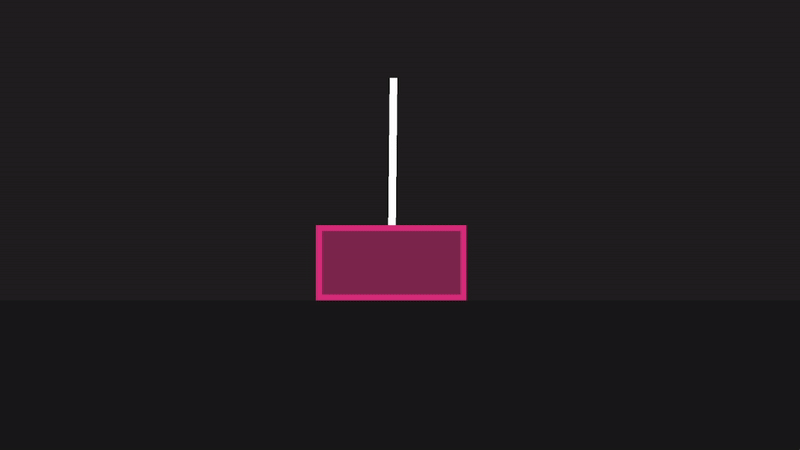
  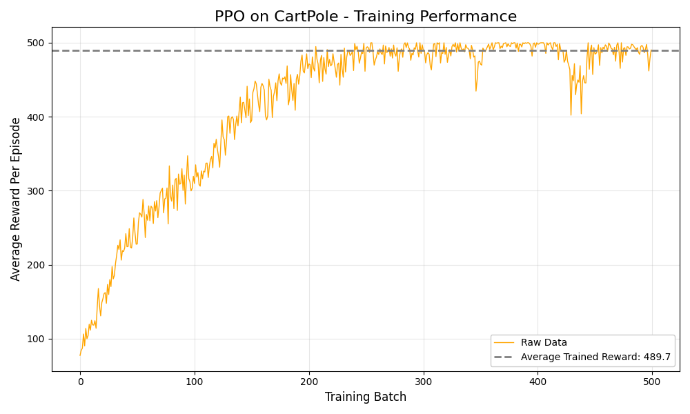

## Highlights

- **PPO (Proximal Policy Optimization)** implementation with actor-critic architecture.
- **REINFORCE policy gradient** implementation with running baseline and Adam optimizer.
- **Adam** and **SGD with Momentum** optimizer implementations.
- **2D physics engine** with rigid bodies, hinge joints, and collisions, built from scratch.
- **Entity Component System** built with EnTT for fast simulation.
- **SFML visualization** with a headless mode for training.
- **Batch trainer** capable of running multiple environments in parallel.
  
## Environment

The environment, defined in [`source/gyms/cartpole.cpp`](source/gyms/cartpole.cpp), is responsible for updating the physics simulation and returning the reward given the agent's action.

- **State space.** A four‑dimensional vector containing the cart position, cart velocity, pole angle and pole angular velocity.
- **Reward function.** The agent receives a unit reward for every timestep in the simulation.
- **Termination.** The episode ends when the cart leaves the ±2.4m bounds, the pole falls beyond ±12°, or after 500 simulation steps.

## Neural Network

The neural network implementation is defined in [`source/rl/neural_network.cpp`](source/rl/neural_network.cpp) and provides a flexible feedforward architecture using Eigen for matrix operations. Its weights are initialized using Xavier/Glorot initialization and each layer supports **ReLU**, **tanh** and **identity** activations.

## PPO Agent

The PPO agent implements the Proximal Policy Optimization algorithm with an actor-critic architecture defined in [`source/rl/ppo_agent.cpp`](source/rl/ppo_agent.cpp).

**Actor Network Architecture:**
- **Input layer (4 neurons).** Cart position, cart velocity, pole angle and pole angular velocity.
- **Hidden layers (128 neurons & 64 neurons)**. ReLU activations.
- **Output layer (2 neurons).** Action logits for discrete actions.

**Critic Network Architecture:**
- **Input layer (4 neurons).** Cart position, cart velocity, pole angle and pole angular velocity.
- **Hidden layers (128 neurons & 64 neurons)**. ReLU activations.
- **Output layer (1 neuron).** State value estimation.

The PPO agent demonstrates superior performance and training stability compared to REINFORCE, consistently reaching the maximum reward of 500 in the CartPole environment.

    

 

## REINFORCE Agent

The REINFORCE agent follows the REINFORCE policy gradient algorithm implemented in [`source/rl/reinforce_agent.cpp`](source/rl/reinforce_agent.cpp). The policy architecture is defined as:

- **Input layer (4 neurons).** Cart position and velocity together with the pole angle and its angular velocity.
- **Hidden layers (128 neurons & 64 neurons)**. ReLU activations.
- **Output layer (2 neurons).** Action logits for discrete actions.

    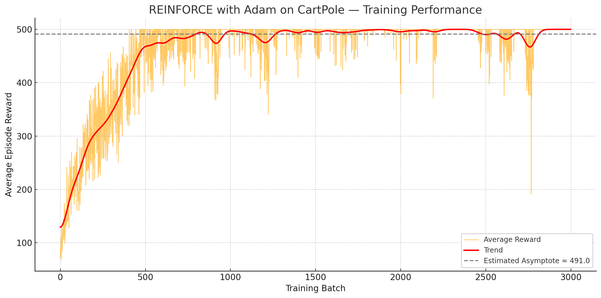

 

A running baseline is subtracted from the returns and the result is normalized by the returns' standard deviation. Introducing a baseline significantly stabilizes training and improves performance, as shown in the plot below.

    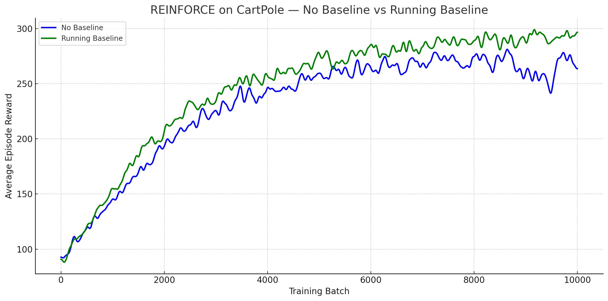

 

In addition to the running baseline, a mean baseline and a no-baseline configuration were evaluated. The table below summarizes the performance of each approach. The running baseline consistently leads to faster convergence compared to a mean baseline or no baseline.

  <table>
    <tr>
      <th>Running Baseline</th>
      <th>Mean Baseline</th>
      <th>No Baseline</th>
    </tr>
    <tr>
      <td>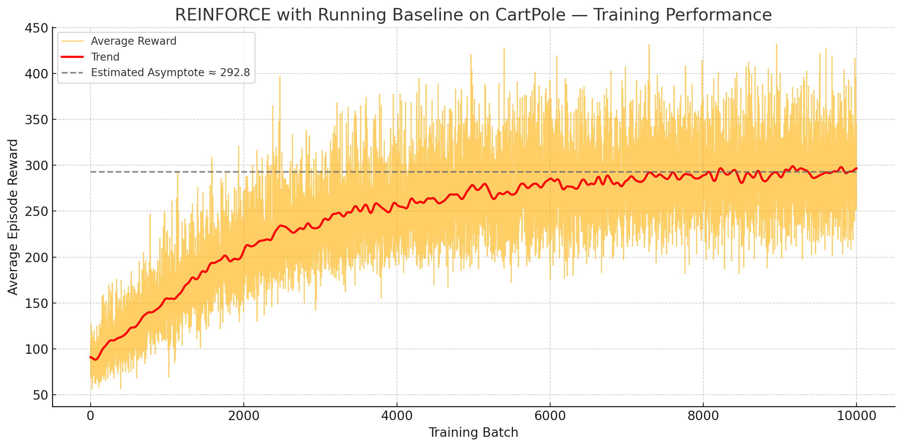</td>
      <td>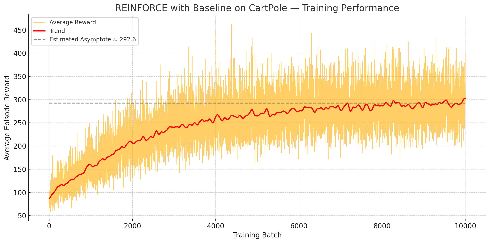</td>
      <td>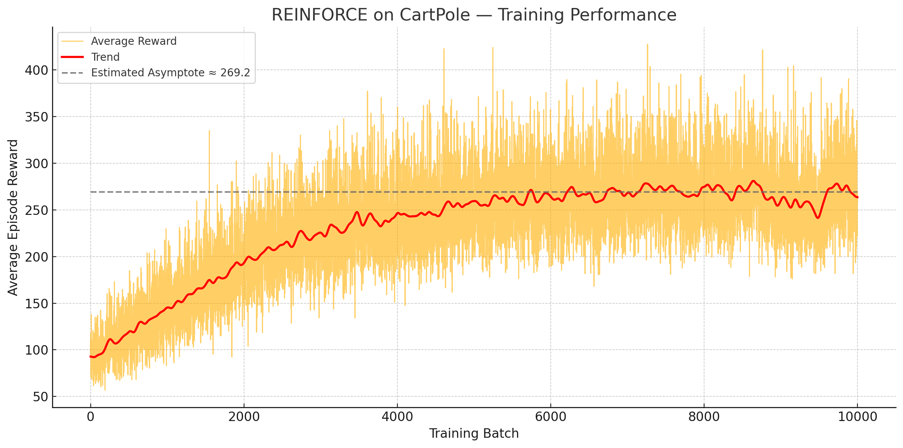</td>
    </tr>
  </table>

## Optimizers

On REINFORCE with an Adam optimizer, the agent reaches an average reward of around 500 after approximately 500 batches. Using a stochastic gradient descent with momentum requires roughly 10 times more batches to achieve the same performance. The first comparison illustrates how momentum accelerates vanilla SGD and how SGD momentum compares with Adam.

  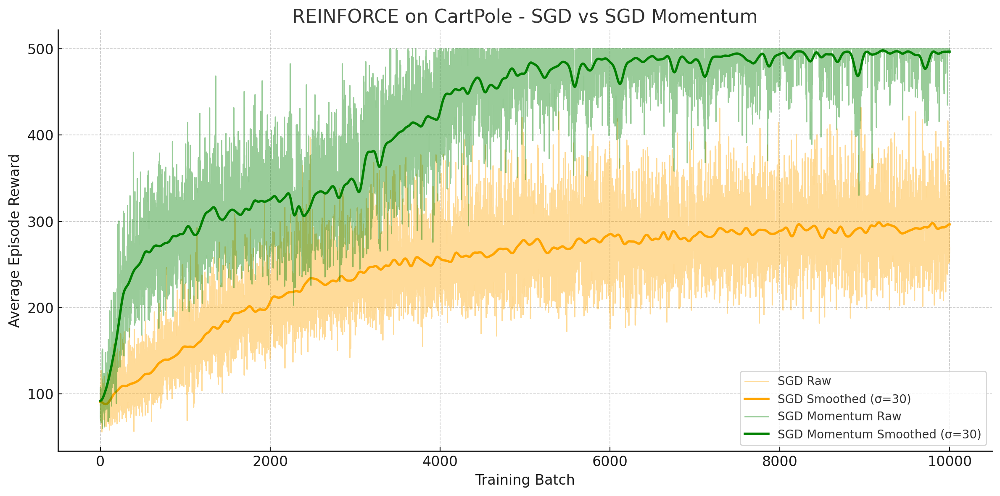
  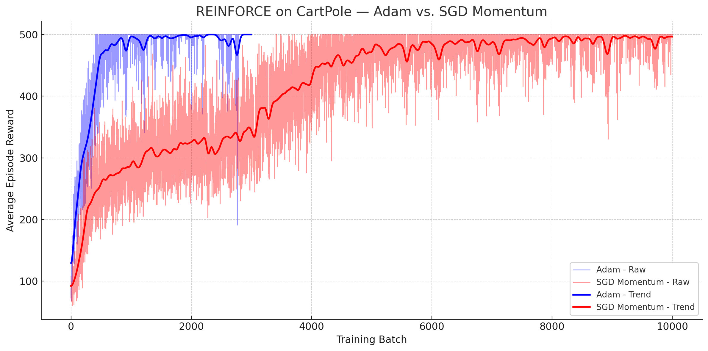

 

The table below shows the learning curves for each optimizer individually.

  <table>
    <tr>
      <th>Adam</th>
      <th>SGD</th>
      <th>SGD Momentum</th>
    </tr>
    <tr>
      <td></td>
      <td>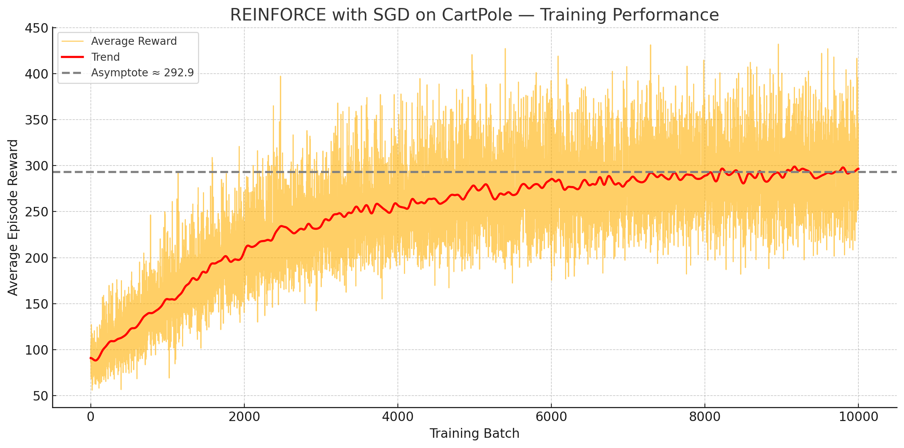</td>
      <td>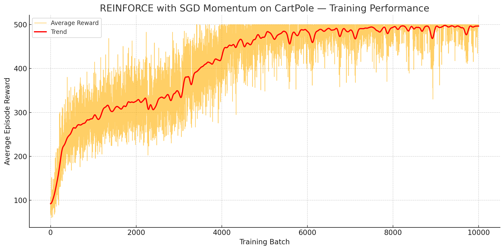</td>
    </tr>
  </table>

 

The learning rate of the Adam optimizer considerably impacts the variance of training and the overall agent performance. Below is a comparison of the Adam optimizer run with 0.0005 learning rate and 0.001 learning rate.

  <figure>
    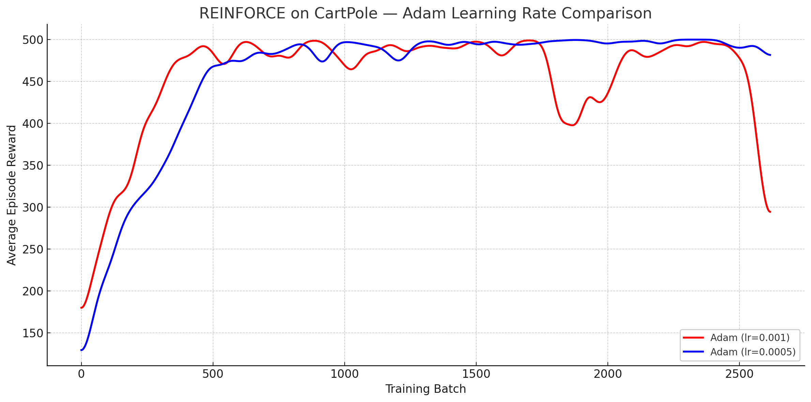
  </figure>

## Building

Project files can be generated using Premake (`premake5 gmake2` or `premake5 vs2022`). Once generated, compile the code with the toolchain of your choice. A convenience script, `generate_project.bat`, is provided for Visual Studio users on Windows.

## License

This project is released under the MIT License.
