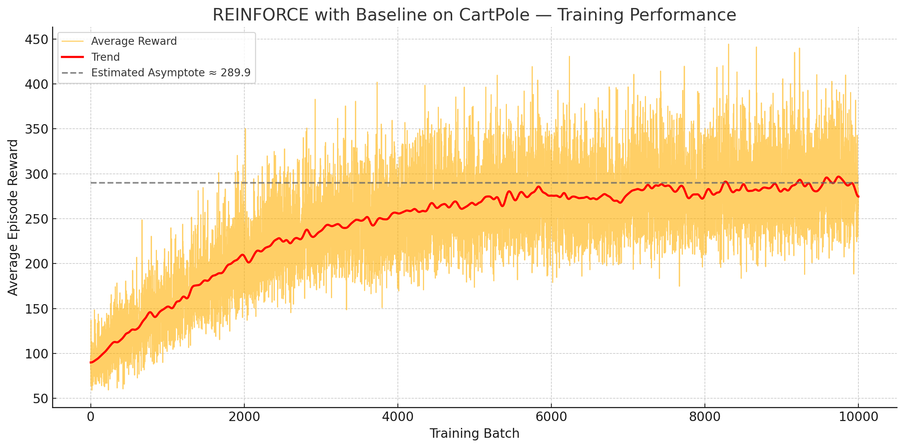
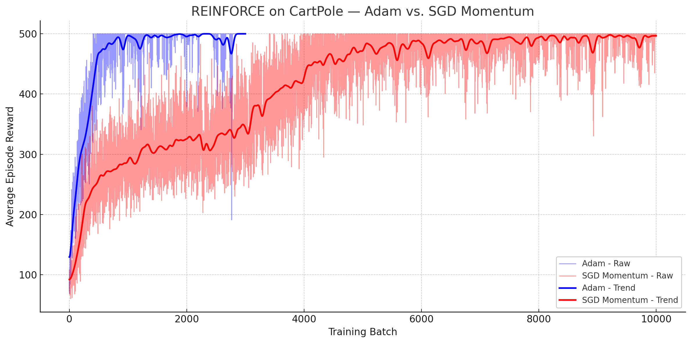

# CartPole Reinforcement Learning

An implementation of the classic cart-pole task built from scratch in C++. The project combines a reinforcement learning framework, a custom physics engine in an entity-component-system, and an SFML-based renderer.

  
  

## Highlights

- **Custom RL library** using Eigen for matrix operations.
- **REINFORCE policy gradient** with running baseline and Adam or SGD optimizers.
- **2D physics engine** with rigid bodies, hinge joints, and collisions built from scratch.
- **Entity Component System** built with EnTT for fast simulation.
- **SFML visualization** with a headless mode for training.
- **Batch trainer** capable of running multiple environments in parallel.

## Environment

The CartPole environment processes the agent's action, returns its reward, and updates the simulation. It is implemented in [`source/gyms/cartpole.cpp`](source/gyms/cartpole.cpp).

- **State:** 4-dimensional continuous space (cart position, cart velocity, pole angle and pole angular velocity)
- **Reward:** +1 for each timestep the pole stays balanced.
- **Termination:** When the cart runs out of bounds (> ±2.4m), the pole falls (> ±12°) or the simulation runs for more than 500 steps.

## Agent

The agent uses the REINFORCE policy gradient algorithm, implemented in [`source/rl/reinforce_agent.cpp`](source/rl/reinforce_agent.cpp).

The policy uses a neural network with two hidden layers. The network uses Xavier initialization. It is built from scratch in [`source/rl/neural_network.cpp`](source/rl/neural_network.cpp).
- **Input Layer (4 neurons)** Cart position, velocity, pole angle, angular velocity.
- **Hidden Layer (128 neurons)** with ReLU activation.
- **Hidden Layer (64 neurons)** with ReLU activation.
- **Output Layer (2 neurons)** that outputs action logits (left/right) turned into probabilities with `softmax`.

### Returns

A running baseline is subtracted from the returns, and returns are normalized by their standard deviation. Using a baseline not only both improves overall agent performance and reduces reward variation throughout training.

Side-by-side comparison of different baselines:

  <table>
    <tr>
      <th>Running Baseline</th>
      <th>Mean Baseline</th>
      <th>No Baseline</th>
    </tr>
    <tr>
      <td></td>
      <td></td>
      <td></td>
    </tr>
  </table>

### Optimizers

With REINFORCE, the agent reaches ~500 average reward in 500 batches with an Adam optimizer. Switching to a SGD optimizer with momentum, the agent reaches the threshold in 5000 batches.

  <table>
    <tr>
      <th>SGD vs SGD Momentum</th>
      <th>SGD Momentum vs Adam</th>
    </tr>
    <tr>
      <td></td>
      <td></td>
    </tr>
  </table>

Side-by-side comparison of different optimizers:

  <table>
    <tr>
      <th>Adam</th>
      <th>SGD</th>
      <th>SGD Momentum</th>
    </tr>
    <tr>
      <td></td>
      <td></td>
      <td></td>
    </tr>
  </table>

Learning rate of Adam optimizer considerably impacts the variance of training, and the overall agent's performance.

## Building

Generate project files with Premake (`premake5 gmake2` or `premake5 vs2022`) and build with your compiler of choice.
For a quick VS2022 setup on Windows, run `generate_project.bat`.

## License

This project is released under the MIT License.
